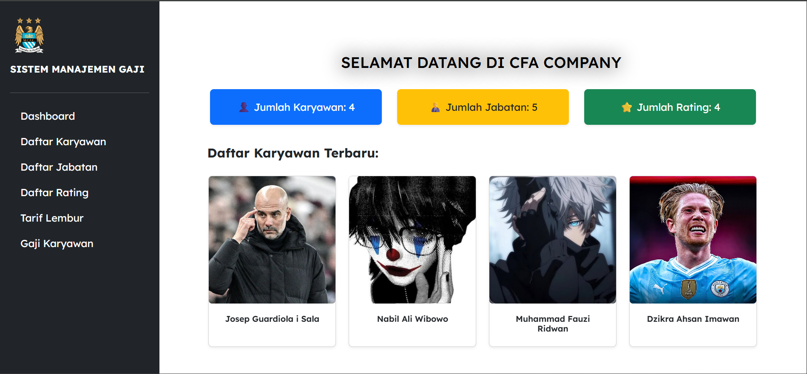

# ✨ Sistem Management Gaji

Hai! 👋  
Ini adalah proyek *sederhana* Sistem Management Gaji yang dibuat pakai PHP + MySQL. Cocok banget buat latihan CRUD, relasi antar tabel, dan sedikit sentuhan UI biar gak bosen 😄

## 🚀 Fitur Singkat
- Tambah, edit, hapus data karyawan
- Kelola jabatan dan rating
- Sistem gaji otomatis berdasarkan jabatan & rating
- Upload foto karyawan
- Tampilan simpel pakai Bootstrap

## 🛠️ Teknologi yang Dipakai
- PHP (native)
- MySQL
- Bootstrap 5
- XAMPP (buat local server)

## 📸 Cuplikan Tampilan
(Sisipkan screenshot atau GIF di sini, contoh:)



## 📦 Cara Install (Lokal)
1. Clone repo ini:
   ```bash
   git clone https://github.com/Dzikraahsan/sistem-management-gaji.git
2. Import file database.sql ke MySQL

3. Letakkan folder ini di htdocs (kalau pakai XAMPP)

4. Buka browser dan akses localhost/Sistem_Management_Gaji

5. Done! 🎉
